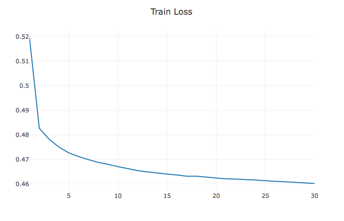
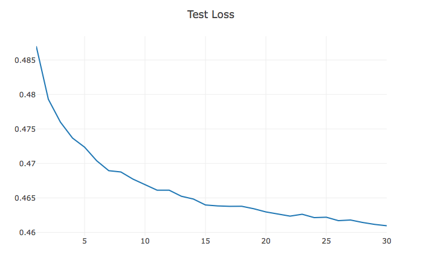
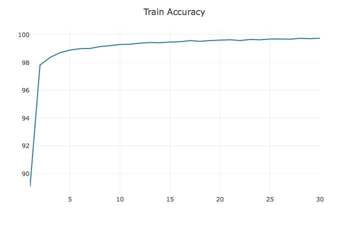
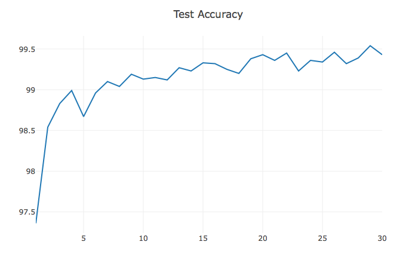
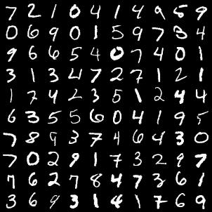
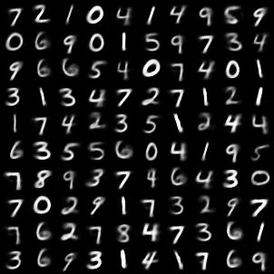

# CapsNet
A PyTorch implementation of CapsNet based on Geoffrey Hinton's paper [Dynamic Routing Between Capsules](https://arxiv.org/abs/1710.09829)

## Requirements
- [Anaconda](https://www.anaconda.com/download/)
- PyTorch
```
conda install pytorch torchvision -c soumith
conda install pytorch torchvision cuda80 -c soumith # install it if you have installed cuda
```
- PyTorchNet
```
pip install git+https://github.com/pytorch/tnt.git@master
```
- tqdm
```
pip install tqdm
```

## Usage

```
git clone https://github.com/leftthomas/CapsNet.git
cd CapsNet
python -m visdom.server & python main.py
```
Visdom now can be accessed by going to `127.0.0.1:8097` in your browser, or your own host address if specified.

## Benchmarks
Highest accuracy was 99.57% after 30 epochs. The model may achieve a higher accuracy as shown by the trend of the loss/accuracy graphs below.

<table>
  <tr>
    <td>
     
    </td>
    <td>
     
    </td>
  </tr>
</table>

<table>
  <tr>
    <td>
     
    </td>
    <td>
     
    </td>
  </tr>
</table>

The reconstructions of the digit numbers are showed at right and the ground truth at left.

<div width="100%">
  
  
</div>

Default PyTorch Adam optimizer hyperparameters were used with no learning rate scheduling. Epochs with batch size of 100 takes ~2 minutes on a NVIDIA GTX 1070. 

## Other Implementations
- [capsnet.pytorch](https://github.com/andreaazzini/capsnet.pytorch.git)

- [CapsNet-Keras](https://github.com/naturomics/XifengGuo/CapsNet-Keras.git)

- [CapsNet-Tensorflow](https://github.com/naturomics/CapsNet-Tensorflow.git)

## Credits
Primarily referenced this implementation:
[PyTorch implementation by @Gram.AI](https://github.com/gram-ai/capsule-networks)
